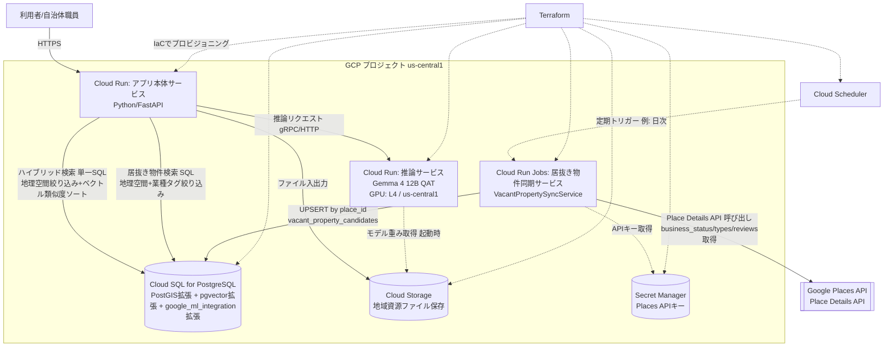
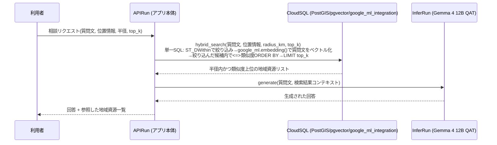
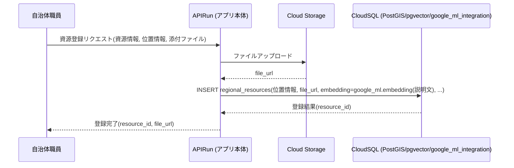
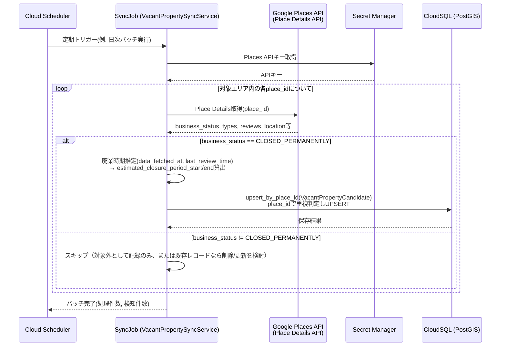
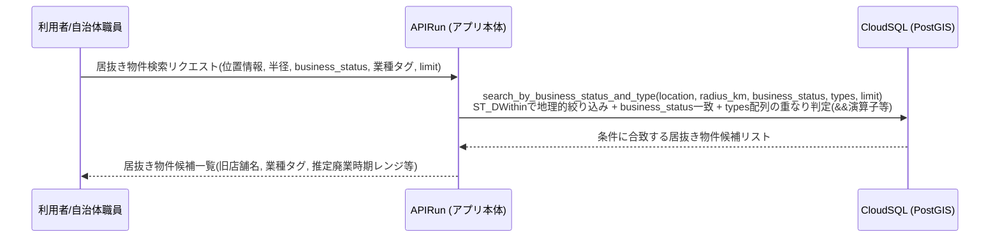

# 設計書: 地方創生支援システム (regional-revitalization-support-system)

## Overview

本システムは、位置情報データベース（地理空間インデックス）とベクトルデータベース（pgvector）を組み合わせたRAG（Retrieval-Augmented Generation）基盤により、地方創生に関する相談・地域資源検索・情報提供を支援するシステムである。ユーザーからの相談内容と位置情報を起点に、指定した位置から半径radius_km以内の地域資源へPostGISで絞り込み、その候補集合の中でクエリテキストとのベクトル類似度が高い順にtop_k件を取得するハイブリッド検索を行い、その結果をコンテキストとしてGCP Cloud Run上にホストされたGemma 4 12B QATモデル（GPU: L4）に投入し、回答を生成する。

システムはGoogle Cloud Platform（リージョン: us-central1）上に構築される。アプリケーション本体はPython製のCloud Runサービス、推論サービスはGPU(L4)を割り当てた別のCloud Runサービスとして分離する。データストアはCloud SQL for PostgreSQL（PostGIS相当の地理空間インデックス、pgvector拡張、およびSQL側でテキストのembeddingを生成する`google_ml_integration`拡張を有効化）を用い、地域資源に紐づくファイル（画像・レポート等）はGoogle Cloud Storageに保存する。テキストのベクトル化（embedding生成）はアプリケーション側では行わず、`google_ml_integration`拡張によりCloud SQL側（SQL関数呼び出し）で実行する。インフラはTerraformでコード化する。

本システムはもう一つの中核価値として、「不動産屋も知らない居抜き物件をGoogleデータから探し出し、出店コストを大幅に下げる」ための居抜き物件発見機能を提供する。Google Maps Platform の Places API（Place Details API）を定期的に呼び出し、対象エリア内のスポットの`business_status`が`CLOSED_PERMANENTLY`（完全閉店・廃業）に変化したことを検知して`VacantPropertyCandidate`としてCloud SQLに保存する。この検知処理は「居抜き物件同期サービス（VacantPropertySyncService）」として、既存のアプリ本体サービス・推論サービスとは別のCloud Run Jobs（Cloud Schedulerによる定期トリガー）として構成し、既存のCloud SQL（PostGIS拡張）の地理空間検索の仕組みを再利用して、位置・業種タグによる居抜き物件の絞り込み検索を可能にする。

ドキュメント・コード内コメントは日本語で記述し、文字コードはUTF-8、改行コードはLFに統一する。

## Architecture



**設計判断とその理由**:

- アプリ本体サービスと推論サービスをCloud Runで分離する理由: GPU(L4)を必要とするのは推論処理のみであり、分離することでアプリ本体サービスはGPUなしの安価な構成でスケールでき、コストを最適化できる。
- Cloud SQL for PostgreSQLに地理空間インデックスとpgvectorを同一DBに統合する理由: 地域資源テーブルに対して「近隣検索（地理空間）」と「類似検索（ベクトル）」を同一トランザクション・同一クエリ経路で扱えるため、ハイブリッド検索（後述）を単一SQLクエリで実現できる。
- embedding生成を`google_ml_integration`拡張によりSQL側（DB側）で行う理由: アプリケーション側で外部のembeddingモデルを呼び出す往復（レイテンシ・ネットワークコスト）を避け、INSERT文・検索クエリ内でembedding生成とベクトル格納/比較を一貫して行えるため、実装と運用が単純化される。
- Cloud Storageをファイル本体の保存先とし、Cloud SQLにはメタデータとURLのみを保存する理由: 大容量バイナリをRDBMSに直接格納しないことで、DBサイズとバックアップコストを抑える。
- 居抜き物件同期サービスをアプリ本体サービスと分離しCloud Run Jobs（Cloud Scheduler経由の定期バッチ）として構成する理由: Places APIの呼び出しは同期的なユーザーリクエストとは無関係な定期バッチ処理であり、常時起動のCloud Runサービスとして持つ必要がない。バッチ実行のみリソースを確保するCloud Run Jobsとすることでコストを最適化し、既存のAPIRun/InferRunのスケーリング特性に影響を与えない設計とする。
- 居抜き物件候補データを既存のCloud SQL（同一インスタンス）に統合する理由: 既存の`regional_resources`テーブルと同じPostGIS地理空間インデックスの仕組み（`GEOGRAPHY(POINT, 4326)`、`ST_DWithin`）を再利用でき、地域資源検索と居抜き物件検索を同一のデータ基盤・同一の運用オペレーションで扱える。

## Sequence Diagrams

### フロー1: 相談応答（ハイブリッド検索 + RAG生成）



### フロー2: 地域資源の登録



### フロー3: 居抜き物件の同期・検知



**設計上の注記（Places API利用規約に関する制約）**: Place ID自体は無期限にキャッシュ可能だが、`business_status`・`types`等の他のフィールドは概ね30日程度で再取得（リフレッシュ）が必要という制約があるため、本フローはCloud Schedulerにより定期的（例: 日次〜週次）に既存の対象place_id群全体を再取得し、`data_fetched_at`を更新し続ける設計とする（詳細はDependencies章参照）。

### フロー4: 居抜き物件の検索



## Components and Interfaces

### コンポーネント1: アプリ本体サービス (APIRun)

**責務**:
- 利用者からのHTTPリクエスト受付（相談、地域資源のCRUD）
- ハイブリッド検索（地理空間フィルタ→ベクトル類似度ソートの単一SQLクエリ）の呼び出し
- 推論サービス（InferRun）へのコンテキスト付きリクエスト送信
- Cloud Storageへのファイルアップロード/署名付きURL発行

**embeddingに関する方針**: embeddingの生成はアプリケーション側では行わない。Cloud SQL for PostgreSQLの`google_ml_integration`拡張により、INSERT文および検索クエリ内のSQL関数呼び出し（`google_ml.embedding(...)`相当）でDB側にてテキストをベクトル化し、pgvectorカラムに格納・比較する。

**インターフェース（Python）**:

```python
from dataclasses import dataclass
from datetime import datetime
from typing import Protocol
from uuid import UUID


@dataclass(frozen=True)
class GeoPoint:
    """地理座標（緯度・経度、EPSG:4326想定）"""
    latitude: float   # -90.0 <= latitude <= 90.0
    longitude: float  # -180.0 <= longitude <= 180.0


@dataclass(frozen=True)
class RegionalResource:
    """地域資源（施設・イベント・支援制度等）"""
    resource_id: UUID
    name: str
    category: str
    description: str
    location: GeoPoint
    file_url: str | None
    embedding: list[float]  # DB側(google_ml_integration拡張)で生成される。次元数は例: 768次元
    created_at: datetime
    updated_at: datetime


@dataclass(frozen=True)
class ConsultationRequest:
    """相談リクエスト"""
    query_text: str
    location: GeoPoint
    radius_km: float
    top_k: int = 5


@dataclass(frozen=True)
class ConsultationResponse:
    """相談応答"""
    generated_text: str
    referenced_resources: list[RegionalResource]


class ResourceRepository(Protocol):
    """地域資源リポジトリ（Cloud SQL for PostgreSQLをバックエンドとする）"""

    def search_nearby(
        self, location: GeoPoint, radius_km: float, limit: int
    ) -> list[RegionalResource]:
        ...

    def search_similar(
        self, embedding: list[float], top_k: int
    ) -> list[RegionalResource]:
        ...

    def search_hybrid(
        self, query_text: str, location: GeoPoint, radius_km: float, top_k: int
    ) -> list[RegionalResource]:
        """単一SQLクエリで、半径radius_km以内に絞り込んだ候補集合の中から
        query_textとのベクトル類似度が高い順にtop_k件を返す。
        embeddingはgoogle_ml_integration拡張によりDB側で生成される"""
        ...

    def insert(self, resource: RegionalResource) -> UUID:
        """resource.description からのembedding生成はDB側(google_ml_integration拡張)で行う"""
        ...


class InferenceClient(Protocol):
    """Gemma 4 12B QAT 推論サービスクライアント"""

    def generate(self, query_text: str, context: list[RegionalResource]) -> str:
        ...


class StorageClient(Protocol):
    """Cloud Storage クライアント"""

    def upload(self, file_bytes: bytes, object_name: str, content_type: str) -> str:
        """アップロードしたオブジェクトの公開/署名付きURLを返す"""
        ...
```

**関連する日本語コメント規約**: 実装時、すべてのdocstring/コメントは日本語・UTF-8・LF改行で記述する。

### コンポーネント2: 推論サービス (InferRun)

**責務**:
- Gemma 4 12B QATモデルをL4 GPU上でロードし、生成リクエストを処理する
- アプリ本体サービスからの内部通信のみを受け付ける（外部非公開、Cloud Run内部トラフィックまたはIAM認証で保護）

**インターフェース（Python / FastAPI想定のリクエスト・レスポンス型）**:

```python
from pydantic import BaseModel


class GenerateRequest(BaseModel):
    """推論リクエスト"""
    prompt: str
    context_snippets: list[str]  # ハイブリッド検索結果を文字列化したもの
    max_tokens: int = 512
    temperature: float = 0.2


class GenerateResponse(BaseModel):
    """推論レスポンス"""
    generated_text: str
    input_tokens: int
    output_tokens: int
```

**責務境界**: InferRunはビジネスロジック（検索・re-rank）を持たず、プロンプトと生成済みコンテキストを受け取ってテキストを生成するだけの薄いサービスとする。

### コンポーネント3: データストア (Cloud SQL for PostgreSQL)

**責務**:
- 地域資源メタデータ、位置情報（地理空間型）、embeddingベクトルの永続化
- 地理空間インデックス（GiST/PostGIS相当）とpgvectorインデックス（HNSW/IVFFlat）による高速検索

**スキーマ概要（DDL相当）**:

```pascal
拡張機能:
  CREATE EXTENSION IF NOT EXISTS postgis;
  CREATE EXTENSION IF NOT EXISTS vector;
  CREATE EXTENSION IF NOT EXISTS google_ml_integration;
  // google_ml_integration: SQL関数呼び出し(google_ml.embedding(...)相当)により
  // テキストのembeddingをDB側で生成するための拡張機能

テーブル regional_resources:
  resource_id   UUID PRIMARY KEY DEFAULT gen_random_uuid()
  name          TEXT NOT NULL
  category      TEXT NOT NULL
  description   TEXT NOT NULL
  location      GEOGRAPHY(POINT, 4326) NOT NULL
  file_url      TEXT NULL
  embedding     VECTOR(768) NOT NULL
  // embeddingはINSERT時にgoogle_ml.embedding(description)相当のSQL関数呼び出しで生成する
  created_at    TIMESTAMPTZ NOT NULL DEFAULT now()
  updated_at    TIMESTAMPTZ NOT NULL DEFAULT now()

インデックス:
  CREATE INDEX idx_resources_location ON regional_resources
    USING GIST (location);
  CREATE INDEX idx_resources_embedding ON regional_resources
    USING hnsw (embedding vector_cosine_ops);

テーブル consultation_logs:
  log_id                 UUID PRIMARY KEY DEFAULT gen_random_uuid()
  query_text             TEXT NOT NULL
  query_location         GEOGRAPHY(POINT, 4326) NOT NULL
  referenced_resource_ids UUID[] NOT NULL
  generated_text         TEXT NOT NULL
  created_at             TIMESTAMPTZ NOT NULL DEFAULT now()

テーブル vacant_property_candidates:
  // 居抜き物件候補（Places APIで検知したCLOSED_PERMANENTLYスポット）
  candidate_id                     UUID PRIMARY KEY DEFAULT gen_random_uuid()
  place_id                         TEXT UNIQUE NOT NULL
  // place_idの一意制約により、同一スポットの重複登録・再取得時の同一性判定を保証する
  name                              TEXT NOT NULL
  location                          GEOGRAPHY(POINT, 4326) NOT NULL
  business_status                   TEXT NOT NULL
  // OPERATIONAL / CLOSED_TEMPORARILY / CLOSED_PERMANENTLY のいずれか(アプリ側でEnum検証)
  types                             TEXT[] NOT NULL
  // 業種・ジャンルタグ配列。例: {restaurant, cafe}
  address                           TEXT NULL
  phone_number                      TEXT NULL
  data_fetched_at                   TIMESTAMPTZ NOT NULL
  last_review_time                  TIMESTAMPTZ NULL
  estimated_closure_period_start    TIMESTAMPTZ NULL
  estimated_closure_period_end      TIMESTAMPTZ NULL
  created_at                        TIMESTAMPTZ NOT NULL DEFAULT now()
  updated_at                        TIMESTAMPTZ NOT NULL DEFAULT now()

インデックス（vacant_property_candidates）:
  CREATE INDEX idx_vacant_properties_location ON vacant_property_candidates
    USING GIST (location);
  CREATE INDEX idx_vacant_properties_business_status ON vacant_property_candidates
    (business_status);
  CREATE INDEX idx_vacant_properties_types ON vacant_property_candidates
    USING GIN (types);
  // place_id には UNIQUE NOT NULL 制約により自動的に一意インデックスが作成される
```

### コンポーネント4: ファイルストレージ (Cloud Storage)

**責務**:
- 地域資源に紐づくファイル（画像・PDF等）の保存
- アプリ本体サービスに対して署名付きURLまたは公開URLを発行

### コンポーネント5: 居抜き物件同期サービス (VacantPropertySyncService)

**責務**:
- Google Maps Platform の Places API（Place Details API）を、Cloud SchedulerによってトリガーされるCloud Run Jobsとして定期的に呼び出し、対象エリア内のスポットの`business_status`を確認する
- `business_status == CLOSED_PERMANENTLY`（完全閉店・廃業）を検知したスポットを`VacantPropertyCandidate`としてCloud SQLに保存/更新する
- `place_id`により既存レコードとの重複を防止し、UPSERT（存在すれば更新、なければ新規作成）する
- レビューの最新更新日時とデータ取得時刻から、廃業時期の推定レンジ（`estimated_closure_period_start`/`estimated_closure_period_end`）を算出する

**重要な制約（Google Places APIの利用規約）**: Place ID自体は無期限にキャッシュ可能だが、`business_status`・`types`・レビュー等の他のフィールドは概ね30日程度で再取得（リフレッシュ）が必要という制約がある。そのため本サービスは、新規スポットの発掘だけでなく、既存の`vacant_property_candidates`レコード（および監視対象スポット）についても定期的にPlace Details APIを再呼び出しし、`data_fetched_at`を更新するリフレッシュ処理を兼ねる設計とする。30日を超えて未更新のレコードは「フィールド情報が利用規約上失効している可能性がある」ものとして扱い、Error Handling章の方針に従う。

**廃業時期推定ロジック**:

```pascal
FUNCTION estimate_closure_period(
    data_fetched_at: TIMESTAMP,
    last_review_time: TIMESTAMP OR NULL
) RETURNS (start: TIMESTAMP OR NULL, end: TIMESTAMP OR NULL)

BEGIN
  // 「最終確認時点でまだ営業中だった可能性が高い時期」の推定レンジを返す
  // 厳密な廃業日ではなく、代理データ（データ取得時刻・最新レビュー時刻）からの推定レンジとして扱う

  IF last_review_time IS NOT NULL THEN
    // 最新レビュー時刻以降、データ取得時刻(CLOSED_PERMANENTLY検知時)までの間に
    // 廃業した可能性が高いと推定する
    start ← last_review_time
    end ← data_fetched_at
  ELSE
    // レビューが存在しない場合、推定不能として範囲をNoneとする
    start ← NULL
    end ← NULL
  END IF

  RETURN (start, end)
END FUNCTION
```

**インターフェース（Python）**:

```python
from dataclasses import dataclass
from datetime import datetime
from enum import Enum
from typing import Protocol


class BusinessStatus(str, Enum):
    """Places APIのbusiness_statusフィールド"""
    OPERATIONAL = "OPERATIONAL"
    CLOSED_TEMPORARILY = "CLOSED_TEMPORARILY"
    CLOSED_PERMANENTLY = "CLOSED_PERMANENTLY"


@dataclass(frozen=True)
class VacantPropertyCandidate:
    """居抜き物件候補（閉店・廃業が検知されたスポット）"""
    place_id: str  # Google Places APIのPlace ID。一意識別子。重複防止・再取得時の同一性判定に使用
    name: str  # 旧店舗名
    location: GeoPoint
    business_status: BusinessStatus
    types: list[str]  # 業種・ジャンルタグ配列（例: ["restaurant", "cafe"]）
    address: str | None
    phone_number: str | None
    data_fetched_at: datetime  # このレコードのデータをGoogleから取得した時刻
    last_review_time: datetime | None  # 取得できた最新レビューの投稿時刻。レビューが存在しない場合はNone
    estimated_closure_period_start: datetime | None  # 推定廃業時期レンジの開始
    estimated_closure_period_end: datetime | None  # 推定廃業時期レンジの終了


class PlacesApiClient(Protocol):
    """Google Places API (Place Details API) クライアント"""

    def get_place_details(self, place_id: str) -> "PlaceDetailsResult":
        """指定place_idの最新詳細情報を取得する。
        レート制限・APIキー無効時は例外を発生させる"""
        ...


@dataclass(frozen=True)
class PlaceDetailsResult:
    """Place Details APIの生レスポンスを表す型"""
    place_id: str
    name: str
    location: GeoPoint
    business_status: BusinessStatus
    types: list[str]
    address: str | None
    phone_number: str | None
    latest_review_time: datetime | None


class VacantPropertySyncService:
    """居抜き物件同期サービス。Cloud Run Jobsとしてバッチ実行される"""

    def sync_area(self, target_place_ids: list[str]) -> "SyncResult":
        """対象place_id群についてPlace Details APIを呼び出し、
        CLOSED_PERMANENTLYを検知したスポットをUPSERTする。
        既存レコードのリフレッシュ（30日以内の再取得）も兼ねる"""
        ...


@dataclass(frozen=True)
class SyncResult:
    """同期バッチの実行結果"""
    processed_count: int
    detected_closure_count: int
    error_count: int
```

**責務境界**: 本サービスはビジネスロジックとしての検索・絞り込みは持たず、Places APIからのデータ取得・`CLOSED_PERMANENTLY`判定・廃業時期推定・DBへのUPSERTのみを担う。居抜き物件の検索はアプリ本体サービス（APIRun）が既存の`ResourceRepository`と同様のパターンで`VacantPropertyRepository`を通じて行う。

**リポジトリインターフェース（Python）**:

```python
class VacantPropertyRepository(Protocol):
    """居抜き物件候補リポジトリ（Cloud SQL for PostgreSQLをバックエンドとする）"""

    def upsert_by_place_id(self, candidate: VacantPropertyCandidate) -> None:
        """place_idで既存レコードとの重複を判定し、存在すれば更新、なければ新規作成する(UPSERT)"""
        ...

    def search_by_business_status_and_type(
        self,
        location: GeoPoint,
        radius_km: float,
        business_status: BusinessStatus,
        types: list[str] | None,
        limit: int,
    ) -> list[VacantPropertyCandidate]:
        """location から半径radius_km以内かつ、指定したbusiness_statusに一致し、
        types が指定されている場合はそのいずれかのタグを含む候補を返す。
        既存のResourceRepositoryと同様、PostGISの地理空間検索(ST_DWithin)を再利用する"""
        ...
```

### コンポーネント6: IaC (Terraform)

**責務**:
- 上記すべてのGCPリソース（Cloud Run x2、Cloud Run Jobs（居抜き物件同期サービス）、Cloud Scheduler、Cloud SQL、Cloud Storage、VPCコネクタ、IAM、Secret Manager等）を宣言的にプロビジョニングする
- モジュール構成例: `modules/network`, `modules/cloudsql`, `modules/storage`, `modules/cloudrun_app`, `modules/cloudrun_inference`, `modules/cloudrun_jobs_vacant_property_sync`, `modules/scheduler`

## Data Models

### モデル1: GeoPoint（位置情報）

```python
@dataclass(frozen=True)
class GeoPoint:
    latitude: float
    longitude: float
```

**検証ルール**:
- `-90.0 <= latitude <= 90.0`
- `-180.0 <= longitude <= 180.0`

### モデル2: RegionalResource（地域資源）

**検証ルール**:
- `name` は空文字列でないこと
- `embedding` の次元数は、Cloud SQLの`google_ml_integration`拡張が生成するembeddingモデルの出力次元数（例: 768）と一致すること
- `location` は有効な`GeoPoint`であること
- `file_url` はNoneまたは有効なGCS URL形式であること

### モデル3: ConsultationRequest / ConsultationResponse（相談リクエスト/応答）

**検証ルール**:
- `query_text` は空文字列でないこと
- `radius_km` は正の数であること（`radius_km > 0`）
- `top_k` は1以上の整数であること

### モデル4: VacantPropertyCandidate（居抜き物件候補）

**検証ルール**:
- `place_id` は空文字列でないこと。かつ`vacant_property_candidates`テーブル内で一意であること
- `name` は空文字列でないこと
- `location` は有効な`GeoPoint`であること
- `business_status` は`BusinessStatus` Enum（`OPERATIONAL`, `CLOSED_TEMPORARILY`, `CLOSED_PERMANENTLY`）のいずれかであること
- `types` は空リストであってもよいが、Noneであってはならない（該当タグが無い場合は空リスト`[]`とする）
- `last_review_time`がNoneの場合、`estimated_closure_period_start`と`estimated_closure_period_end`は共にNoneであること（推定不能）
- `estimated_closure_period_start`と`estimated_closure_period_end`が共に非Noneの場合、`estimated_closure_period_start <= estimated_closure_period_end`であること
- `data_fetched_at` は未来の時刻でないこと

## Algorithmic Pseudocode（アルゴリズムと形式仕様）

### 関数1: search_nearby_resources()

```python
def search_nearby_resources(
    location: GeoPoint, radius_km: float, limit: int
) -> list[RegionalResource]:
    """指定した位置から半径radius_km以内の地域資源を、距離が近い順に返す"""
```

**事前条件 (Preconditions)**:
- `location` は有効な緯度経度を持つ（`-90<=lat<=90`, `-180<=lon<=180`）
- `radius_km > 0`
- `limit >= 1`

**事後条件 (Postconditions)**:
- 戻り値の要素数は `limit` 以下
- 戻り値に含まれる全ての資源について、`location`との地理的距離が`radius_km`以下である
- 戻り値は`location`からの距離の昇順にソートされている
- DBに副作用を与えない（読み取り専用）

**ループ不変条件 (Loop Invariants)**: 該当なし（単一SQLクエリで実現、アプリ側ループなし）

### 関数2: search_similar_resources()

```python
def search_similar_resources(
    embedding: list[float], top_k: int
) -> list[RegionalResource]:
    """クエリembeddingとのコサイン類似度が高い順にtop_k件の地域資源を返す"""
```

**事前条件**:
- `embedding` の次元数は格納済みembeddingの次元数と一致する
- `top_k >= 1`

**事後条件**:
- 戻り値の要素数は `top_k` 以下（データ件数が`top_k`未満の場合はデータ件数と一致）
- 戻り値はコサイン類似度の降順にソートされている
- DBに副作用を与えない

**ループ不変条件**: 該当なし

### 関数3: hybrid_search()

**アルゴリズム概要（段階的/nestedフィルタリング方式）**:

RRF（Reciprocal Rank Fusion）による並列統合はもう用いない。代わりに、以下2段階を単一SQLクエリで実行する:

1. Step 1（PostGISによる絞り込み）: `ST_DWithin`等の地理空間条件を`WHERE`句に指定し、`location`から半径`radius_km`以内の資源に候補集合を絞り込む
2. Step 2（候補集合内でのベクトル類似度ソート）: Step 1で絞り込んだ候補集合の中で、`query_text`から`google_ml_integration`拡張により生成したembeddingとのpgvectorコサイン距離（`<=>`演算子）で`ORDER BY`し、上位`top_k`件を`LIMIT`で取得する

```python
def hybrid_search(
    query_text: str,
    location: GeoPoint,
    radius_km: float,
    top_k: int,
) -> list[RegionalResource]:
    """PostGISで半径radius_km以内に絞り込んだ候補集合の中から、
    query_textとのベクトル類似度が高い順にtop_k件を返す（単一SQLクエリ）"""
    # 実行されるSQLの概念的な内容（アプリ側で埋め込みは生成しない）:
    #
    # SELECT *
    # FROM regional_resources
    # WHERE ST_DWithin(
    #         location,
    #         ST_MakePoint(:longitude, :latitude)::geography,
    #         :radius_km * 1000
    #       )
    # ORDER BY embedding <=> google_ml.embedding(:query_text)
    # LIMIT :top_k;
    #
    # - WHERE句(Step 1)で半径radius_km以内の候補集合に絞り込む
    # - 候補集合が0件の場合、ORDER BY以降のベクトル類似度計算は行われず空リストが返る
    # - 単一クエリの結果セットであるため、候補集合内・戻り値内に重複行は発生しない
    return resource_repository.search_hybrid(query_text, location, radius_km, top_k)
```

**事前条件**:
- `query_text` は空文字列でない
- `location` は有効な`GeoPoint`
- `radius_km > 0`、`top_k >= 1`

**事後条件**:
- 戻り値の要素数は `min(候補集合のサイズ, top_k)` である。ここで候補集合とは、`location`から`radius_km`以内にある資源の集合を指す
- 戻り値に含まれる全ての資源`r`について、`distance(r.location, location) <= radius_km`が成立する（地理的整合性）
- 戻り値は候補集合の中でクエリembeddingとのコサイン類似度の降順にソートされている
- 候補集合が0件（`radius_km`以内に資源が存在しない）場合、ベクトル類似度計算は実行されず、戻り値は空リストである
- 単一SQLクエリの結果セットであるため、戻り値に重複する`resource_id`は発生しない（一意性は自明に保たれる）
- DBに副作用を与えない（読み取り専用）

**ループ不変条件**: 該当なし（地理空間フィルタとベクトル類似度ソートは単一SQLクエリのWHERE句/ORDER BY句で実現され、アプリ側でのループ処理・スコア統合処理は存在しない）

### 関数4: generate_consultation_response()

```python
def generate_consultation_response(
    request: ConsultationRequest,
) -> ConsultationResponse:
    """ハイブリッド検索結果をコンテキストとしてGemma 4 12B QATに生成を依頼する"""
    resources = hybrid_search(
        request.query_text, request.location, request.radius_km, request.top_k
    )
    generated_text = inference_client.generate(request.query_text, resources)
    return ConsultationResponse(
        generated_text=generated_text, referenced_resources=resources
    )
```

**事前条件**:
- `request` は`ConsultationRequest`の検証ルールを満たす

**事後条件**:
- `referenced_resources` は `hybrid_search` が返した結果と一致する
- `generated_text` は空文字列でない（推論サービスが正常応答した場合）
- 推論サービス呼び出しが失敗した場合は例外を発生させ、部分的な結果を返さない（原子性）

**ループ不変条件**: 該当なし

### 関数5: register_resource()

```python
def register_resource(
    name: str,
    category: str,
    description: str,
    location: GeoPoint,
    file_bytes: bytes | None,
    content_type: str | None,
) -> RegionalResource:
    """地域資源を登録する。ファイルがあればCloud Storageへアップロードし、
    説明文のembedding生成はCloud SQL側(google_ml_integration拡張)に委ねてINSERTする"""
    file_url = None
    if file_bytes is not None:
        object_name = f"resources/{uuid4()}"
        file_url = storage_client.upload(file_bytes, object_name, content_type)

    # embeddingフィールドはアプリ側で計算しない。
    # resource_repository.insert() が発行するINSERT文の中で
    # google_ml.embedding(description) 相当のSQL関数呼び出しにより
    # DB側でembeddingが生成され、embeddingカラムに格納される。
    resource = RegionalResource(
        resource_id=uuid4(),
        name=name,
        category=category,
        description=description,
        location=location,
        file_url=file_url,
        embedding=[],  # プレースホルダ。実際の値はDB側で生成される
        created_at=datetime.utcnow(),
        updated_at=datetime.utcnow(),
    )
    resource_repository.insert(resource)
    return resource
```

**事前条件**:
- `name`、`category`、`description` は空文字列でない
- `location` は有効な`GeoPoint`
- `file_bytes`が非Noneの場合、`content_type`も非Noneであること

**事後条件**:
- 戻り値の`resource_id`はDBに存在する一意なIDである
- `file_bytes`が指定された場合、戻り値の`file_url`はNoneでなく、Cloud Storage上に対応するオブジェクトが存在する
- `file_bytes`がNoneの場合、`file_url`はNoneのままである
- DBに格納された`embedding`の次元数は、Cloud SQLの`google_ml_integration`拡張が生成するembeddingモデルの出力次元数（`VECTOR(768)`）と一致する

**ループ不変条件**: 該当なし

### 関数6: sync_vacant_properties()

```python
def sync_vacant_properties(target_place_ids: list[str]) -> SyncResult:
    """対象place_id群についてPlace Details APIを呼び出し、business_statusを確認する。
    CLOSED_PERMANENTLYを検知した場合、廃業時期を推定してUPSERTする。
    既存レコードのリフレッシュ(30日以内の再取得)も兼ねる"""
    processed = 0
    detected = 0
    errors = 0
    for place_id in target_place_ids:
        try:
            details = places_api_client.get_place_details(place_id)
        except PlacesApiError:
            errors += 1
            continue

        processed += 1
        if details.business_status == BusinessStatus.CLOSED_PERMANENTLY:
            start, end = estimate_closure_period(
                data_fetched_at=datetime.utcnow(),
                last_review_time=details.latest_review_time,
            )
            candidate = VacantPropertyCandidate(
                place_id=details.place_id,
                name=details.name,
                location=details.location,
                business_status=details.business_status,
                types=details.types,
                address=details.address,
                phone_number=details.phone_number,
                data_fetched_at=datetime.utcnow(),
                last_review_time=details.latest_review_time,
                estimated_closure_period_start=start,
                estimated_closure_period_end=end,
            )
            vacant_property_repository.upsert_by_place_id(candidate)
            detected += 1
    return SyncResult(
        processed_count=processed, detected_closure_count=detected, error_count=errors
    )
```

**事前条件**:
- `target_place_ids` は空リストであってもよい（この場合`processed_count=0`で正常終了する）
- Places APIキーがSecret Manager経由で有効に取得できる

**事後条件**:
- 戻り値の`processed_count`は、正常にPlace Details APIレスポンスを取得できた件数である
- `business_status == CLOSED_PERMANENTLY`が検知された各place_idについて、`vacant_property_candidates`テーブルに`place_id`をキーとしたレコードが存在する（新規作成または更新）
- 同一`place_id`について本関数を複数回呼び出しても、`vacant_property_candidates`テーブル内の該当`place_id`のレコードは常に1件のみである（UPSERTの冪等性）
- Places API呼び出しが失敗したplace_idは`error_count`に加算され、処理は中断せず次のplace_idへ継続する（部分失敗を許容する設計）

**ループ不変条件**:
- ループの各反復開始時点で、それまでに処理済みのplace_idに対応する`vacant_property_candidates`レコードは、直前の反復で書き込まれた内容と一致している（他の反復による上書きは発生しない。各反復は異なる`place_id`を対象とするため）

### 関数7: estimate_closure_period()

```python
def estimate_closure_period(
    data_fetched_at: datetime, last_review_time: datetime | None
) -> tuple[datetime | None, datetime | None]:
    """データ取得時刻と最新レビュー時刻から、
    「最終確認時点でまだ営業中だった可能性が高い時期」の推定レンジを返す。
    厳密な廃業日ではなく代理データからの推定レンジとして扱う"""
    if last_review_time is None:
        return None, None
    return last_review_time, data_fetched_at
```

**事前条件**:
- `data_fetched_at` は未来の時刻でない

**事後条件**:
- `last_review_time is None` の場合、戻り値は`(None, None)`である（推定不能）
- `last_review_time is not None` の場合、戻り値`(start, end)`について`start == last_review_time`, `end == data_fetched_at`であり、`start <= end`が成立する（`last_review_time <= data_fetched_at`である限り）

**ループ不変条件**: 該当なし

### 関数8: search_vacant_properties()

```python
def search_vacant_properties(
    location: GeoPoint,
    radius_km: float,
    business_status: BusinessStatus,
    types: list[str] | None,
    limit: int,
) -> list[VacantPropertyCandidate]:
    """指定した位置・半径・business_status・業種タグに合致する居抜き物件候補を返す"""
    return vacant_property_repository.search_by_business_status_and_type(
        location, radius_km, business_status, types, limit
    )
```

**事前条件**:
- `location` は有効な`GeoPoint`
- `radius_km > 0`、`limit >= 1`
- `types`はNoneまたは空でない文字列のリスト

**事後条件**:
- 戻り値の要素数は`limit`以下
- 戻り値に含まれる全ての候補`c`について、`distance(c.location, location) <= radius_km`が成立する（地理的整合性）
- 戻り値に含まれる全ての候補`c`について、`c.business_status == business_status`が成立する
- `types`が指定されている場合、戻り値に含まれる全ての候補`c`について、`c.types`と`types`の積集合が空でない（少なくとも1つのタグが一致する）
- DBに副作用を与えない（読み取り専用）

**ループ不変条件**: 該当なし（単一SQLクエリで実現）

## Example Usage

```python
# 例1: 地域資源の登録
resource = register_resource(
    name="道の駅 湖畔の郷",
    category="観光施設",
    description="地元産の農産物直売所と休憩施設。子育て支援窓口も併設。",
    location=GeoPoint(latitude=35.4, longitude=138.9),
    file_bytes=open("brochure.pdf", "rb").read(),
    content_type="application/pdf",
)
print(resource.resource_id, resource.file_url)

# 例2: 相談応答（RAG）
request = ConsultationRequest(
    query_text="子育て世帯向けの支援制度を知りたい",
    location=GeoPoint(latitude=35.4, longitude=138.9),
    radius_km=10.0,
    top_k=5,
)
response = generate_consultation_response(request)
print(response.generated_text)
for r in response.referenced_resources:
    print(r.name, r.category)

# 例3: ハイブリッド検索のみを直接利用する場合
# (単一SQLクエリで、半径radius_km以内の候補集合に絞り込んだ上で
#  ベクトル類似度が高い順にtop_k件を取得する。embedding生成はDB側で行われる)
results = hybrid_search(
    query_text="空き家活用の事例",
    location=GeoPoint(latitude=35.4, longitude=138.9),
    radius_km=20.0,
    top_k=3,
)

# 例4: 居抜き物件同期バッチ(Cloud Run Jobsから起動される想定)
sync_result = sync_vacant_properties(
    target_place_ids=["ChIJ_xxxxx1", "ChIJ_xxxxx2", "ChIJ_xxxxx3"],
)
print(sync_result.processed_count, sync_result.detected_closure_count)

# 例5: 居抜き物件の検索(位置・業種タグで絞り込み)
candidates = search_vacant_properties(
    location=GeoPoint(latitude=35.4, longitude=138.9),
    radius_km=5.0,
    business_status=BusinessStatus.CLOSED_PERMANENTLY,
    types=["restaurant", "cafe"],
    limit=10,
)
for c in candidates:
    print(c.place_id, c.name, c.types, c.estimated_closure_period_start, c.estimated_closure_period_end)
```

## Correctness Properties

正当性プロパティ: 以下は実装が満たすべき性質を全称量化された形で記述したものである。テストコード（単体テスト、Property-Based Testing）の作成時にはこれらを検証対象とする。

### Property 1: 地理空間検索の距離制約

任意の`location`, `radius_km > 0`, `limit >= 1`に対し、`search_nearby_resources(location, radius_km, limit)`が返す全ての資源`r`について、`distance(r.location, location) <= radius_km`が成立する。

**Validates: Requirements 2.1**

### Property 2: 地理空間検索の件数制約

任意の入力に対し、`len(search_nearby_resources(location, radius_km, limit)) <= limit`が成立する。

**Validates: Requirements 2.3**

### Property 3: 地理空間検索の順序性

任意の入力に対し、戻り値のリストは`location`からの距離について単調非減少（昇順）である。

**Validates: Requirements 2.2**

### Property 4: ベクトル検索の件数制約

任意の`embedding`, `top_k >= 1`に対し、`len(search_similar_resources(embedding, top_k)) <= top_k`が成立する。

**Validates: Requirements 3.3**

### Property 5: ベクトル検索の順序性

任意の入力に対し、戻り値のリストはクエリembeddingとのコサイン類似度について単調非増加（降順）である。

**Validates: Requirements 3.2**

### Property 6: ハイブリッド検索の一意性

`hybrid_search(...)`は、地理空間フィルタとベクトル類似度ソートを単一SQLクエリの`WHERE`句/`ORDER BY`句/`LIMIT`句で実行し、結果を統合する後処理（RRF等）を行わない。したがって、任意の入力に対し、返されるリスト中に同一`resource_id`が2回以上出現しないことは、単一クエリの結果セットの性質上自明に保たれる。

**Validates: Requirements 4.2**

### Property 7: ハイブリッド検索の件数制約

任意の入力に対し、`len(hybrid_search(query_text, location, radius_km, top_k)) == min(N, top_k)`が成立する。ここで`N`は`location`から`radius_km`以内にある地域資源の件数（候補集合のサイズ）である。特に`N == 0`の場合、`hybrid_search(...)`は空リストを返す。

**Validates: Requirements 4.4**

### Property 8: 登録の往復性（round-trip）

任意の有効な登録入力`(name, category, description, location, file_bytes, content_type)`に対し、`register_resource(...)`で登録した資源を`resource_id`で再取得すると、`name`, `category`, `description`, `location`が登録時の値と一致する。

**Validates: Requirements 5.5**

### Property 9: ファイル有無とURLの整合性

任意の登録入力に対し、`file_bytes is None ⟺ resource.file_url is None`が成立する。

**Validates: Requirements 5.2, 5.3**

### Property 10: 位置情報の範囲不変条件

システムが受理する任意の`GeoPoint`について、常に`-90 <= latitude <= 90`かつ`-180 <= longitude <= 180`が成立する（不正な範囲の場合は登録・検索リクエストが検証エラーとして拒否される）。

**Validates: Requirements 6.1, 6.2, 6.3**

### Property 11: ハイブリッド検索の地理的整合性

任意の入力に対し、`hybrid_search(query_text, location, radius_km, top_k)`が返す全ての資源`r`について、`distance(r.location, location) <= radius_km`が成立する（ベクトル類似度によるソートは、地理空間フィルタで絞り込んだ候補集合の内部でのみ行われる）。

**Validates: Requirements 4.1, 4.3**

### Property 12: place_idの一意性

任意の`place_id`に対し、`vacant_property_candidates`テーブル内に同一`place_id`を持つレコードは1件以下しか存在しない。`upsert_by_place_id(...)`を同一`place_id`で複数回呼び出しても、レコード件数は増加せず既存レコードが更新されるのみである。

**Validates: Requirements 7.2**

### Property 13: 居抜き物件検索の業種フィルタの正確性

任意の`location`, `radius_km > 0`, `business_status`, `types`（Noneまたは非空リスト）, `limit >= 1`に対し、`search_vacant_properties(location, radius_km, business_status, types, limit)`が返す全ての候補`c`について、`c.business_status == business_status`が成立し、かつ`types`が指定されている場合は`c.types`と`types`の積集合が空でない。

**Validates: Requirements 7.4, 7.5**

### Property 14: 居抜き物件検索の地理的整合性

任意の入力に対し、`search_vacant_properties(...)`が返す全ての候補`c`について、`distance(c.location, location) <= radius_km`が成立する。

**Validates: Requirements 7.3**

### Property 15: 居抜き物件検索の件数制約

任意の入力に対し、`len(search_vacant_properties(location, radius_km, business_status, types, limit)) <= limit`が成立する。

**Validates: Requirements 7.4**

### Property 16: 廃業時期推定レンジの整合性

任意の`data_fetched_at`, `last_review_time`に対し、`estimate_closure_period(data_fetched_at, last_review_time)`が返す`(start, end)`について、`last_review_time is None ⟺ (start, end) == (None, None)`が成立する。また`last_review_time`が非Noneかつ`last_review_time <= data_fetched_at`の場合、`start <= end`が成立する。

**Validates: Requirements 8.3, 8.4**

## Error Handling

### エラーシナリオ1: 不正な位置情報

**条件**: `latitude`/`longitude`が有効範囲外、または`radius_km <= 0`が指定された場合
**対応**: アプリ本体サービスがリクエストバリデーション層で400 Bad Requestを返し、DBアクセスは行わない
**復旧**: 利用者側でリクエストを修正して再送する

### エラーシナリオ2: 推論サービス(InferRun)の応答タイムアウト/エラー

**条件**: GPU(L4)資源不足によるコールドスタート遅延、モデル推論エラー、Cloud Run間通信のタイムアウト
**対応**: アプリ本体サービスは指定タイムアウト（例: 30秒）でリクエストを打ち切り、502/504相当のエラーを利用者に返す。検索結果（`referenced_resources`）のみを返すフォールバックも検討する
**復旧**: リトライ（指数バックオフ）を最大2回まで行う。InferRun側はCloud Runの最小インスタンス数を1以上に設定してコールドスタートを緩和する

### エラーシナリオ3: Cloud SQL接続エラー/クエリタイムアウト

**条件**: コネクションプール枯渇、地理空間/ベクトルインデックス未使用によるクエリ遅延
**対応**: アプリ本体サービスは503を返し、詳細エラーはログにのみ出力（利用者には汎用メッセージ）
**復旧**: Cloud SQL Proxyのコネクションプール設定を見直し、`EXPLAIN ANALYZE`でインデックス使用を確認する

### エラーシナリオ4: Cloud Storageアップロード失敗

**条件**: ネットワークエラー、権限不足、ファイルサイズ超過
**対応**: `register_resource()`はアップロード失敗時に例外を伝播し、DBへのINSERTを実行しない（部分登録を防ぐ）
**復旧**: 利用者にエラーメッセージを返し、ファイルサイズ・形式を確認のうえ再送を促す

### エラーシナリオ5: Embedding次元不一致/生成エラー

**条件**: `google_ml_integration`拡張が参照するembeddingモデルの変更等により、生成されたベクトルの次元数がDBスキーマの`VECTOR(768)`と一致しない、またはSQL関数呼び出し（`google_ml.embedding(...)`相当）自体がエラーを返す（モデル未接続、権限不足等）
**対応**: INSERT/検索時にDB側の型制約違反またはSQL関数エラーとして検知し、アプリ側で500エラーとしてログに記録
**復旧**: マイグレーションでスキーマの次元数を更新し、既存データの再embedding処理を実施する。SQL関数呼び出しエラーの場合は`google_ml_integration`拡張の設定（接続先モデル、権限）を確認する

### エラーシナリオ6: Places API呼び出し失敗（レート制限/APIキー無効等）

**条件**: Places APIのレート制限超過（429相当）、APIキーの無効化・権限不足（403相当）、対象place_idが存在しない（404相当）、ネットワークタイムアウト
**対応**: `sync_vacant_properties()`は失敗したplace_id単位で例外を捕捉し、`error_count`に加算した上で処理を継続する（1件のエラーでバッチ全体を中断しない）。レート制限検知時は指数バックオフでリトライし、上限回数を超えた場合はそのplace_idをスキップして次回バッチに委ねる
**復旧**: APIキー無効時はSecret Manager上のキーを確認・再発行する。レート制限が頻発する場合はバッチの対象件数・実行頻度・並列度を調整する。エラー発生率が高い場合はCloud Monitoringでアラートを発報する

### エラーシナリオ7: 30日リフレッシュ制約に違反しそうな古いレコード

**条件**: `vacant_property_candidates`レコードの`data_fetched_at`が30日近傍または30日を超えて更新されていない（Places APIの利用規約上、`business_status`等のフィールドの正確性が保証されない状態）
**対応**: 同期バッチは`data_fetched_at`が古い順にレコードを優先的に再取得対象とする。検索API（`search_vacant_properties`）は、`data_fetched_at`が30日を超えたレコードについて、レスポンスに「データが古い可能性がある」ことを示す注記（例: `is_stale: true`相当のフラグ）を付与することを検討する
**復旧**: Cloud Schedulerの実行頻度（例: 日次）を、監視対象place_id数とAPIのレート制限・コストのバランスを見て調整し、全対象レコードが30日以内に再取得されるようにスケジュール設計・監視を行う

## Testing Strategy

### 単体テスト方針

- 各リポジトリメソッド（`search_nearby`, `search_similar`, `search_hybrid`, `insert`）はテスト用PostgreSQL（PostGIS/pgvector/`google_ml_integration`拡張を有効化したコンテナまたはCloud SQL相当環境）に対して実行し、境界値（`radius_km`が0に近い値、`top_k=1`、候補集合0件等）を検証する
- `hybrid_search`は単一SQLクエリで完結するため、地理空間条件（`ST_DWithin`）とベクトル類似度ソート（`<=>`演算子）を含むSQL自体をテスト用DBに対して実行し、WHERE句による絞り込みとORDER BY句による並び順を検証する
- `register_resource`のINSERT処理は、DB側で生成された`embedding`カラムが期待次元数（768）で格納されることを検証する
- バリデーション（`GeoPoint`の範囲チェック等）は境界値・異常値を含めて網羅する

### Property-Based Testing方針

**Property Test Library**: Hypothesis（Python）

- 「正当性プロパティ」章に列挙した性質1〜16をそれぞれProperty-Based Testの対象とする
- 例: `search_nearby_resources`に対しては、ランダムに生成した`GeoPoint`・`radius_km`・地域資源データセットを用い、戻り値の全要素が距離制約を満たすことを検証する
- 例: `hybrid_search`に対しては、ランダムな位置情報・`radius_km`・地域資源データセットを用い、戻り値の全要素が半径以内であること（地理的整合性）、件数が`min(候補集合サイズ, top_k)`と一致すること、候補集合0件時に空リストが返ることを検証する
- 例: `upsert_by_place_id`に対しては、ランダムに生成した`VacantPropertyCandidate`（同一`place_id`を持つ複数バリエーションを含む）を用い、同一`place_id`での複数回UPSERT後もテーブル内の該当レコードが1件のみであることを検証する（Property 12）
- 例: `search_by_business_status_and_type`に対しては、ランダムな位置情報・`business_status`・業種タグ・候補データセットを用い、戻り値の全要素が指定した`business_status`と一致し指定した`types`のいずれかを含み、かつ半径以内であることを検証する（Property 13, 14, 15）
- 例: `estimate_closure_period`に対しては、ランダムな`data_fetched_at`・`last_review_time`（Noneを含む）の組を用い、`last_review_time is None`のときの戻り値が`(None, None)`であること、非Noneのときの範囲整合性を検証する（Property 16）

### 統合テスト方針

- Cloud Run（アプリ本体・推論サービス）、Cloud Run Jobs（居抜き物件同期サービス）、Cloud SQL、Cloud Storageを含むステージング環境で、フロー1（相談応答）、フロー2（資源登録）、フロー3（居抜き物件の同期・検知）、フロー4（居抜き物件の検索）のエンドツーエンドテストを実施する
- 推論サービスについては、実際のGemma 4 12B QATモデルを用いたテストに加え、モック推論サービス（固定応答を返す）を用いた高速なCI用テストを併用する
- 居抜き物件同期サービスについては、実際のPlaces APIを用いたテスト（少数の実在place_idに対するE2E検証）に加え、モックPlaces APIクライアント（固定の`business_status`/`types`/レビュー時刻を返す）を用いた高速なCI用テストを併用し、`CLOSED_PERMANENTLY`検知時のUPSERT・廃業時期推定ロジックを検証する

## Performance Considerations

- **GPU起動時間**: Gemma 4 12B QATのロードにはコールドスタート時間がかかるため、InferRunのCloud Runサービスは最小インスタンス数（`min instances >= 1`）を設定し、常時ウォーム状態を維持することを推奨する
- **ベクトルインデックス**: pgvectorはHNSWインデックスを使用し、`m`, `ef_construction`等のパラメータをデータ量に応じて調整する。ただし`hybrid_search`はPostGISの`WHERE`句で候補集合を先に絞り込むため、絞り込み後の候補集合が小さい場合はプランナがベクトルインデックスを使わずシーケンシャルスキャン+ソートを選択することがある。データ量・半径の分布に応じて`EXPLAIN ANALYZE`で実行計画を確認する
- **単一クエリ化によるレイテンシ削減**: `hybrid_search`は地理空間フィルタとベクトル類似度ソートを単一SQLクエリで実行するため、従来の並列実行+アプリ側統合（RRF）で発生していた複数クエリの往復・統合処理のオーバーヘッドは発生しない
- **DB側embedding生成のコスト**: `google_ml_integration`拡張によるembedding生成はSQL関数呼び出しのたびにDB側で計算コストが発生するため、`register_resource()`のINSERT頻度や`hybrid_search()`の呼び出し頻度に応じてCloud SQLインスタンスのスペック（CPU/メモリ）を見積もる
- **Cloud SQLコネクション管理**: Cloud Run側はコネクションプーラー（例: `pgbouncer`相当、またはCloud SQL Auth Proxyのプール機能）を使用し、スケールアウト時のコネクション数増加に備える
- **Places API呼び出しコスト・レート制限**: Place Details APIの呼び出しは課金対象かつレート制限があるため、居抜き物件同期サービスは監視対象place_id数に応じてバッチの並列度・実行頻度を調整し、不要な重複呼び出しを避ける（`place_id`単位のUPSERTにより同一スポットへの重複INSERTは防止されるが、API呼び出し自体の頻度は別途制御する必要がある）
- **業種タグ検索のインデックス**: `vacant_property_candidates.types`（`TEXT[]`）に対するGINインデックスにより、業種タグでの絞り込み検索（`&&`演算子等での重なり判定）を高速化する

## Security Considerations

- **サービス間通信**: APIRunからInferRunへの呼び出しはCloud RunのIAM認証（サービスアカウント経由の識別トークン）を用い、InferRunは`allUsers`に公開しない
- **Cloud SQL接続**: Cloud SQL Auth ProxyまたはプライベートIP + VPCコネクタ経由で接続し、パブリックIPを無効化する
- **認証情報管理**: DB接続情報等のシークレットはSecret Managerで管理し、Terraformの状態ファイルに平文で残さない
- **Cloud Storageアクセス制御**: アップロードされたファイルは非公開バケットに格納し、利用者への提供は署名付きURL（有効期限付き）で行う
- **入力検証**: 位置情報・クエリ文字列等はアプリ本体サービスの境界で必ず検証し、SQLインジェクション対策としてパラメータ化クエリ（ORMまたはプレースホルダ）を使用する
- **個人情報の取り扱い**: `consultation_logs`に記録するクエリ内容に個人情報が含まれる可能性があるため、保持期間・アクセス権限をポリシーとして定める（詳細は要件定義で確認）
- **Places APIキーの管理**: Google Places APIキーはSecret Managerで管理し、Terraformの状態ファイルに平文で残さない。居抜き物件同期サービス（Cloud Run Jobs）にのみ、当該Secretへのアクセス権限（IAM）を付与し、他コンポーネントからは参照不可とする
- **居抜き物件データの取り扱い**: `vacant_property_candidates`に格納する旧店舗名・住所・電話番号等は、廃業済みスポットの事業者情報である。閲覧権限（利用者/自治体職員のロール）や、誤って営業中の情報として利用されないよう`business_status`・`data_fetched_at`の明示を検索結果に含めることをアプリ側の表示仕様として徹底する

## Dependencies

- **クラウド基盤**: Google Cloud Platform（us-central1リージョン）
  - Cloud Run（アプリ本体サービス、推論サービス）
  - Cloud Run Jobs（居抜き物件同期サービス: VacantPropertySyncService）
  - Cloud Scheduler（居抜き物件同期サービスの定期トリガー用）
  - Cloud SQL for PostgreSQL（PostGIS拡張、pgvector拡張、google_ml_integration拡張）
  - Cloud Storage
  - Secret Manager（DB接続情報、Places APIキー等のシークレット管理）
  - VPCコネクタ（Cloud Run ⇔ Cloud SQL プライベート接続用）
- **推論モデル**: Gemma 4 12B QAT（GPU: NVIDIA L4）
- **外部API**: Google Maps Platform Places API（Place Details API）
  - **利用規約上の制約**: Place IDは無期限にキャッシュ可能だが、`business_status`・`types`・レビュー等の他フィールドは概ね30日程度で再取得（リフレッシュ）が必要。居抜き物件同期サービスはこの制約を前提に、Cloud Schedulerによる定期実行（例: 日次〜週次）で既存レコードを継続的にリフレッシュする設計とする
- **アプリケーション言語/フレームワーク**: Python、FastAPI（想定）、asyncpgまたはSQLAlchemy + psycopg（PostGIS/pgvector対応ドライバ）
- **IaC**: Terraform（Google Cloudプロバイダ）
- **テストライブラリ**: pytest、Hypothesis（Property-Based Testing）
- **文書/コード規約**: 日本語コメント・ドキュメント、UTF-8エンコーディング、LF改行コード
