# Implementation Plan: 地方創生支援システム (regional-revitalization-support-system)

## Overview

本タスクリストは`design.md`および`requirements.md`に基づき、地方創生支援システムの実装をインクリメンタルに進めるためのものである。データモデル・検証ロジック→検索機能（地理空間/ベクトル/ハイブリッド）→登録機能→推論サービス連携→インフラ(Terraform)の順に構築する。各機能実装後には対応するProperty-Based Test（Hypothesis）または単体テストを作成し、テスト駆動で正当性を確認する。

## Task Dependency Graph

```mermaid
graph TD
    T1[1. 基盤とデータモデル] --> T1_1[1.1 GeoPoint検証]
    T1_1 --> T1_2[1.2 GeoPoint検証プロパティテスト]
    T1 --> T2[2. 地理空間検索]
    T2 --> T2_1[2.1 距離/順序/件数プロパティテスト]
    T2 --> T2_2[2.2 入力検証/副作用なしテスト]
    T1 --> T3[3. ベクトル検索]
    T3 --> T3_1[3.1 類似度順序/件数プロパティテスト]
    T3 --> T3_2[3.2 次元不一致/副作用なしテスト]
    T2 --> T4[4. ハイブリッド検索<br/>PostGIS絞り込み+pgvectorソート]
    T3 --> T4
    T4 --> T4_1[4.1 一意性/件数制約/地理的整合性プロパティテスト]
    T1 --> T5[5. 地域資源登録]
    T5 --> T5_1[5.1 入力検証テスト]
    T5 --> T5_2[5.2 file_url整合性プロパティテスト]
    T5 --> T5_3[5.3 round-tripプロパティテスト]
    T5 --> T5_4[5.4 アップロード失敗テスト]
    T4 --> T6[6. 推論サービス連携]
    T6 --> T6_1[6.1 相談入力検証テスト]
    T6 --> T6_2[6.2 正常系プロパティテスト]
    T6 --> T6_3[6.3 エラー伝播テスト]
    T6 --> T6_4[6.4 トークン数テスト]
    T2 --> T7[7. SQLインジェクション対策]
    T3 --> T7
    T5 --> T7
    T7 --> T7_1[7.1 SQLメタ文字プロパティテスト]
    T2 --> T8[8. Cloud SQLリポジトリ実装]
    T3 --> T8
    T4 --> T8
    T5 --> T9[9. Cloud Storage連携]
    T9 --> T9_1[9.1 署名付きURLテスト]
    T6 --> T10[10. アプリ本体API]
    T5 --> T10
    T6 --> T11[11. 推論サービスAPI]
    T8 --> T12[12. Terraformインフラ]
    T9 --> T12
    T11 --> T12
    T10 --> T13[13. 結合テストと最終確認]
    T12 --> T13
    T1 --> T14[14. 居抜き物件データモデルとリポジトリ]
    T14 --> T14_1[14.1 place_id一意性プロパティテスト]
    T14 --> T15[15. 廃業時期推定ロジック]
    T15 --> T15_1[15.1 廃業時期推定レンジ整合性プロパティテスト]
    T14 --> T16[16. 居抜き物件検索機能]
    T16 --> T16_1[16.1 地理的整合性/業種フィルタ/件数制約プロパティテスト]
    T14 --> T17[17. Places APIクライアントと同期サービス]
    T17 --> T17_1[17.1 部分失敗許容/冪等性テスト]
    T14 --> T18[18. Cloud SQL用VacantPropertyRepository実装]
    T16 --> T18
    T17 --> T19[19. 同期サービスCloud Run Jobsエントリポイント]
    T18 --> T19
    T10 --> T20[20. 居抜き物件検索APIエンドポイント]
    T16 --> T20
    T18 --> T12
    T19 --> T12
    T20 --> T13
```



```json
{
  "waves": [
    { "wave": 1, "tasks": ["1", "1.1", "1.2"] },
    { "wave": 2, "tasks": ["2", "2.1", "2.2", "3", "3.1", "3.2", "5", "5.1", "5.2", "5.3", "5.4", "14"] },
    { "wave": 3, "tasks": ["4", "4.1", "7", "7.1", "9", "9.1", "14.1", "15", "16", "17"] },
    { "wave": 4, "tasks": ["6", "6.1", "6.2", "6.3", "6.4", "8", "15.1", "16.1", "17.1", "18"] },
    { "wave": 5, "tasks": ["10", "11", "19"] },
    { "wave": 6, "tasks": ["12", "20"] },
    { "wave": 7, "tasks": ["13"] }
  ]
}
```

## Tasks

- [x] 1. プロジェクト基盤とデータモデルの実装
  - Pythonプロジェクト構成（`pyproject.toml`または`requirements.txt`、`pytest`、`hypothesis`を依存に追加）を作成する
  - `GeoPoint`, `RegionalResource`, `ConsultationRequest`, `ConsultationResponse`のデータクラスを実装する
  - すべてのdocstring/コメントは日本語・UTF-8・LF改行で記述する
  - _Requirements: 6.1, 6.2, 11.1, 11.2, 11.3_

- [x] 1.1 GeoPointの範囲検証ロジックを実装する
  - `GeoPoint`生成時またはバリデーション関数内で緯度(-90~90)・経度(-180~180)の範囲チェックを行い、範囲外の場合は検証エラー（例: `ValueError`）を発生させる
  - _Requirements: 6.1, 6.2, 6.3_

- [x] 1.2 GeoPoint範囲検証のプロパティテストを作成する
  - Hypothesisでランダムな緯度・経度（範囲内・範囲外の両方を含む）を生成し、Property 10（位置情報の範囲不変条件）を検証する
  - 範囲内の値は例外を発生させず、範囲外の値は必ず検証エラーとなることを確認する
  - _Requirements: 6.1, 6.2, 6.3_
  - _Property: Property 10_

- [x] 2. 地理空間検索機能の実装
  - `ResourceRepository`インターフェース（Protocol）を実装し、テスト用インメモリリポジトリ（`InMemoryResourceRepository`）を作成する。地理的距離計算はHaversine公式等で実装する
  - `search_nearby_resources(location, radius_km, limit)`関数を実装する。事前条件（`radius_km>0`, `limit>=1`, 有効な`location`）を満たさない場合は検証エラーを発生させる
  - _Requirements: 2.1, 2.2, 2.3, 2.5_

- [x] 2.1 地理空間検索の距離制約・順序性・件数制約のプロパティテストを作成する
  - Hypothesisでランダムな`location`、`radius_km`（正の数）、`limit`（1以上の整数）、地域資源データセット（ランダムな位置を持つ複数件）を生成する
  - Property 1（距離制約）: 戻り値の全資源について`location`との距離が`radius_km`以下であることを検証する
  - Property 3（順序性）: 戻り値のリストが距離の昇順であることを検証する
  - Property 2（件数制約）: 戻り値の件数が`limit`以下であることを検証する
  - _Requirements: 2.1, 2.2, 2.3_
  - _Property: Property 1, Property 2, Property 3_

- [x] 2.2 地理空間検索の入力検証と副作用なしの単体テストを作成する
  - `radius_km<=0`または不正な`location`（範囲外の緯度経度）を与えた場合に検証エラーが発生することを確認する
  - 検索実行前後でリポジトリの内部状態（データ件数等）が変化しないことを確認する
  - _Requirements: 2.4, 2.5_

- [x] 3. ベクトル検索機能の実装
  - `search_similar_resources(embedding, top_k)`関数を実装する。コサイン類似度計算関数を実装し、事前条件（`top_k>=1`、embedding次元数の一致）を検証する
  - `InMemoryResourceRepository`にベクトル検索機能を追加する
  - _Requirements: 3.1, 3.2, 3.3, 3.5_

- [x] 3.1 ベクトル検索の類似度順序性・件数制約のプロパティテストを作成する
  - Hypothesisでランダムなembeddingベクトル（固定次元、例: 768次元より小さい次元でテスト用に簡略化しても可）と候補データセットを生成する
  - Property 5（順序性）: 戻り値がコサイン類似度の降順であることを検証する
  - Property 4（件数制約）: 戻り値の件数が`top_k`以下であることを検証する
  - _Requirements: 3.1, 3.2_
  - _Property: Property 4, Property 5_

- [x] 3.2 ベクトル検索の次元不一致エラーと副作用なしの単体テストを作成する
  - 格納済みembeddingと異なる次元数のクエリembeddingを与えた場合にエラーが発生することを確認する
  - 検索実行前後でリポジトリの内部状態が変化しないことを確認する
  - _Requirements: 3.3, 3.5_

- [x] 4. ハイブリッド検索（PostGIS絞り込み+pgvectorソートの段階的統合）機能の実装
  - `ResourceRepository`に`search_hybrid(query_text, location, radius_km, top_k)`メソッドを追加する（design.mdのインターフェースと一致させる）。`InMemoryResourceRepository`ではPostGIS/pgvectorの単一SQLクエリを模した段階的フィルタリング（Step 1: 半径`radius_km`以内への絞り込み、Step 2: 絞り込んだ候補集合内でのコサイン類似度ソート＋`top_k`件への切り詰め）をインメモリで再現する。候補集合が0件の場合はベクトル類似度計算を行わず空リストを返す
  - `hybrid_search(query_text, location, radius_km, top_k)`関数を実装する。`resource_repository.search_hybrid(...)`を呼び出すだけの薄いラッパーとし、embedding生成・RRF統合・重複除去・スコア統合等のアプリ側ロジックは持たない（embeddingはDB側の`google_ml_integration`拡張で生成される）
  - _Requirements: 4.1, 4.2, 4.3, 4.4, 4.5, 4.6, 4.7_

- [x] 4.1 ハイブリッド検索の一意性・件数制約・地理的整合性のプロパティテストを作成する
  - Hypothesisでランダムな`location`、`radius_km`（正の数）、`top_k`（1以上の整数）、地域資源データセット（半径内・半径外の資源が混在するケースを含む）を生成し、`hybrid_search`（`InMemoryResourceRepository.search_hybrid`経由）をテストする
  - Property 6（一意性）: 単一クエリの結果セットであるため、戻り値に同一`resource_id`が2回以上出現しないことを検証する
  - Property 7（件数制約）: 戻り値の件数が`min(候補集合のサイズ, top_k)`と一致することを検証する。候補集合が0件のケースを含め、その場合は空リストが返ることを確認する
  - Property 11（地理的整合性）: 戻り値に含まれる全ての資源について、`location`との地理的距離が`radius_km`以下であることを検証する
  - _Requirements: 4.1, 4.3, 4.4, 4.5, 4.6, 4.7_
  - _Property: Property 6, Property 7, Property 11_

- [x] 5. 地域資源登録機能の実装
  - `StorageClient`インターフェース（Protocol）を実装し、テスト用インメモリ実装（`InMemoryStorageClient`）を作成する
  - `register_resource(name, category, description, location, file_bytes, content_type)`関数を実装する。入力検証（空文字列チェック、`GeoPoint`検証、`file_bytes`と`content_type`の組み合わせ検証）を行う
  - embeddingはアプリケーション側では生成しない。ファイルアップロード成功後、`resource.embedding`をプレースホルダ（空リスト等）としたまま`ResourceRepository.insert()`を呼び出し、実DB実装（タスク8）ではINSERT文内でCloud SQLの`google_ml_integration`拡張のSQL関数呼び出しによりdescriptionからembeddingをDB側で生成・格納する。アップロード失敗時は`insert()`を呼び出さずに例外を伝播させる
  - _Requirements: 5.1, 5.2, 5.3, 5.4, 5.6, 5.7, 5.8_

- [x] 5.1 地域資源登録の入力検証の単体テストを作成する
  - `name`/`category`/`description`のいずれかが空文字列の場合、`location`が範囲外の場合、`file_bytes`指定時に`content_type`が未指定の場合にそれぞれ検証エラーが発生することを確認する
  - _Requirements: 5.6, 5.7, 5.8_

- [x] 5.2 添付ファイル有無とfile_urlの整合性のプロパティテストを作成する
  - Hypothesisでランダムな有効入力（`file_bytes`がNoneの場合とバイト列が与えられる場合の両方）を生成する
  - Property 9（ファイル有無とURLの整合性）: `file_bytes is None ⟺ resource.file_url is None`が成立することを検証する
  - _Requirements: 5.2, 5.3_
  - _Property: Property 9_

- [x] 5.3 登録の往復性（round-trip）のプロパティテストを作成する
  - Hypothesisでランダムな有効入力（`name`, `category`, `description`, `location`, 任意の`file_bytes`/`content_type`）を生成し、`register_resource()`で登録後、`resource_id`で再取得する
  - Property 8（round-trip）: 再取得した資源の`name`, `category`, `description`, `location`が登録時の値と一致することを検証する
  - _Requirements: 5.5_
  - _Property: Property 8_

- [x] 5.4 アップロード失敗時の部分登録防止の単体テストを作成する
  - `StorageClient.upload()`が例外を発生させるようモック化し、`register_resource()`呼び出し後に`ResourceRepository.insert()`が呼び出されていないことを確認する
  - _Requirements: 5.4_

- [x] 6. 推論サービス連携（InferenceClient）の実装
  - `InferenceClient`インターフェース（Protocol）と、テスト用モック実装（固定応答またはシナリオ応答を返す`MockInferenceClient`）を実装する
  - `generate_consultation_response(request)`関数を実装する。`ConsultationRequest`の検証、`hybrid_search()`呼び出し、`InferenceClient.generate()`呼び出しを行い、`ConsultationResponse`を返す
  - _Requirements: 1.1, 1.4, 7.2_

- [x] 6.1 相談リクエストの入力検証の単体テストを作成する
  - `query_text`が空文字列、または`radius_km<=0`の場合に検証エラーが発生することを確認する
  - `top_k`未指定時にデフォルト値5が使用されることを確認する
  - _Requirements: 1.2, 1.3, 1.6_

- [x] 6.2 相談応答の正常系プロパティテストを作成する
  - Hypothesisでランダムな有効`ConsultationRequest`と、`hybrid_search`のモック結果を生成し、`generate_consultation_response()`の戻り値の`referenced_resources`が`hybrid_search`の結果と一致し、`generated_text`が空文字列でないことを検証する
  - _Requirements: 1.4_

- [x] 6.3 推論サービス失敗時のエラー伝播の単体テストを作成する
  - `InferenceClient.generate()`が例外を発生させる、またはタイムアウトするケースをモック化し、`generate_consultation_response()`が部分的な結果を返さずに例外を伝播することを確認する
  - _Requirements: 1.5, 7.4_

- [x] 6.4 推論サービスの入出力トークン数の単体テストを作成する
  - `MockInferenceClient`の`GenerateResponse`に対し、`input_tokens`/`output_tokens`が0以上の整数であることを確認する（0件のコンテキスト・空の生成結果を含むケース）
  - _Requirements: 7.2_

- [x] 7. SQLインジェクション対策の確認（パラメータ化クエリ）
  - `ResourceRepository`の実DB実装（Cloud SQL for PostgreSQL用、`asyncpg`または`SQLAlchemy`+`psycopg`を使用）を実装し、すべてのクエリをパラメータ化クエリ（プレースホルダ）で構築する
  - _Requirements: 12.2_

- [x] 7.1 SQLメタ文字を含む入力に対するプロパティテストを作成する
  - Hypothesisでシングルクォート、セミコロン、SQLコメント記号等を含む`name`/`description`/`query_text`をランダムに生成し、`register_resource()`・`search_similar_resources()`等の呼び出しが例外を発生させず、入力値がそのまま保存・比較に使われることを検証する（テスト用インメモリ実装、または実DB統合テストのいずれかで実施）
  - _Requirements: 12.2_

- [x] 8. Cloud SQL for PostgreSQL用リポジトリ実装とスキーマ定義
  - `regional_resources`テーブル、`consultation_logs`テーブルのDDL（PostGIS拡張・pgvector拡張・`google_ml_integration`拡張の有効化、GiSTインデックス、HNSWインデックスを含む）をマイグレーションスクリプトとして作成する。`regional_resources`テーブルのINSERT文では`embedding`列を`google_ml.embedding(description)`相当のSQL関数呼び出しでDB側から生成・格納する
  - `ResourceRepository`のPostgreSQL実装（`search_nearby`, `search_similar`, `insert`）を作成する
  - `search_hybrid(query_text, location, radius_km, top_k)`のPostgreSQL実装を作成する。単一SQLクエリ内で`WHERE`句の`ST_DWithin`により`location`から半径`radius_km`以内に候補集合を絞り込み、`ORDER BY embedding <=> google_ml.embedding(query_text)`（`google_ml_integration`拡張によるDB側embedding生成＋pgvectorコサイン距離演算子）で候補集合内をソートし、`LIMIT top_k`で結果を取得する
  - PostGIS/pgvector/`google_ml_integration`拡張を有効化したテスト用コンテナ環境（例: Docker）で、`search_nearby`, `search_similar`, `search_hybrid`, `insert`の統合テストを実施する
  - _Requirements: 4.1, 4.2, 4.3, 4.4, 8.1, 8.2, 8.3_

- [x] 9. Cloud Storage連携の実装
  - `StorageClient`のGoogle Cloud Storage実装を作成する。非公開バケットへのアップロードと、有効期限付き署名付きURLの発行を行う
  - _Requirements: 9.1, 9.2, 9.3_

- [x] 9.1 署名付きURL発行の単体テストを作成する
  - Google Cloud Storageクライアントをモック化し、`upload()`呼び出し後に署名付きURL（有効期限が設定されたURL）が返却されることを確認する
  - _Requirements: 9.2, 9.3_

- [x] 10. アプリ本体サービス（FastAPI）のAPIエンドポイント実装
  - `POST /consultations`（相談応答）、`POST /resources`（地域資源登録）等のエンドポイントを実装し、これまで実装した関数群を呼び出す
  - リクエストバリデーションエラー時は400、推論/DBエラー時は502/503/500等の適切なステータスコードを返す
  - _Requirements: 1.1, 1.2, 1.3, 1.5, 5.1_

- [x] 11. 推論サービス（InferRun）のFastAPIエンドポイント実装
  - `POST /generate`エンドポイントを実装し、`GenerateRequest`を受け取りGemma 4 12B QATモデルで生成し、`GenerateResponse`を返す
  - サービス間認証（Cloud Run IAM認証）の検証ミドルウェアを実装する（ローカルテストではモック認証で代替）
  - _Requirements: 7.1, 7.2, 7.3, 12.1_

- [x] 12. Terraformによるインフラのコード化
  - `modules/network`（VPCコネクタ）、`modules/cloudsql`（Cloud SQL for PostgreSQL、PostGIS/pgvector拡張有効化含む）、`modules/storage`（非公開Cloud Storageバケット）、`modules/cloudrun_app`（アプリ本体サービス）、`modules/cloudrun_inference`（推論サービス、GPU L4、us-central1）を作成する
  - Secret Managerを使用したDB接続情報等のシークレット管理を実装し、Terraform状態ファイルに平文の認証情報が残らないことを確認する
  - すべてのリソースがus-central1リージョンに作成されるよう設定する
  - `modules/cloudrun_jobs_vacant_property_sync`（居抜き物件同期サービスのCloud Run Jobs）、`modules/scheduler`（Cloud Scheduler、定期トリガー）を追加で作成する。Places APIキーをSecret Managerに登録し、居抜き物件同期サービスの実行用サービスアカウントにのみアクセス権限を付与するIAM設定を追加する
  - _Requirements: 7.1, 8.4, 9.1, 10.1, 10.2, 10.3, 13.6_

- [x] 13. 全体結合テストとドキュメント最終確認
  - フロー1（相談応答）・フロー2（地域資源登録）のエンドツーエンドテストをステージング環境（またはローカルのモック構成）で実施する
  - すべてのソースファイル・ドキュメントが日本語コメント・UTF-8・LF改行で統一されていることをリンタ/スクリプトで確認する
  - フロー3（居抜き物件の同期・検知）・フロー4（居抜き物件の検索）のエンドツーエンドテストをステージング環境（またはローカルのモック構成）で実施する。`sync_vacant_properties()`によるCLOSED_PERMANENTLY検知からUPSERT、`search_vacant_properties()`による検索までの一連の流れを確認する
  - _Requirements: 1.1, 5.1, 11.1, 11.2, 11.3, 13.1, 13.2, 15.1_

- [x] 14. 居抜き物件データモデルとリポジトリの実装
  - `VacantPropertyCandidate`, `BusinessStatus` Enum, `PlaceDetailsResult`, `SyncResult`のデータクラスを実装する
  - `VacantPropertyRepository`インターフェース（Protocol）とテスト用インメモリ実装（`InMemoryVacantPropertyRepository`）を作成する。`upsert_by_place_id()`は`place_id`で既存レコードを検索し、存在すれば更新・なければ新規追加する
  - すべてのdocstring/コメントは日本語・UTF-8・LF改行で記述する
  - _Requirements: 13.2, 13.3, 14.4_

- [x]* 14.1 place_id一意性のプロパティテストを作成する
  - Hypothesisで同一`place_id`を含む複数回のUPSERTをランダムに生成し、`upsert_by_place_id()`呼び出し後に`vacant_property_candidates`相当のレコードが常に1件のみであることを検証する
  - Property 12（place_idの一意性）: 任意の`place_id`に対し、同一`place_id`を持つレコードは1件以下しか存在しないことを検証する
  - _Requirements: 13.2_
  - _Property: Property 12_

- [x] 15. 廃業時期推定ロジックの実装
  - `estimate_closure_period(data_fetched_at, last_review_time)`を実装する。`last_review_time`が非Noneの場合`(last_review_time, data_fetched_at)`を、Noneの場合`(None, None)`を返す
  - _Requirements: 14.1, 14.2, 14.3, 14.4_

- [x]* 15.1 廃業時期推定レンジ整合性のプロパティテストを作成する
  - Hypothesisで`last_review_time`がNone/非Noneの両方のケース、および`data_fetched_at`をランダムに生成し、`estimate_closure_period()`をテストする
  - Property 16（廃業時期推定レンジの整合性）: `last_review_time is None ⟺ (start, end) == (None, None)`が成立し、`last_review_time`が非Noneかつ`last_review_time <= data_fetched_at`の場合`start <= end`が成立することを検証する
  - _Requirements: 14.1, 14.2, 14.4_
  - _Property: Property 16_

- [x] 16. 居抜き物件検索機能の実装
  - `search_vacant_properties(location, radius_km, business_status, types, limit)`を実装する
  - `InMemoryVacantPropertyRepository`に地理空間（既存のHaversine距離計算を再利用）+`business_status`一致+`types`積集合による絞り込みロジックを`search_by_business_status_and_type()`として追加する
  - _Requirements: 15.1, 15.2, 15.3, 15.4, 15.5, 15.6_

- [x]* 16.1 居抜き物件検索の地理的整合性・業種フィルタ・件数制約のプロパティテストを作成する
  - Hypothesisでランダムな`location`、`radius_km`（正の数）、`business_status`、`types`（Noneまたは非空リスト）、`limit`（1以上の整数）、居抜き物件候補データセットを生成する
  - Property 14（地理的整合性）: 戻り値の全候補について`location`との距離が`radius_km`以下であることを検証する
  - Property 13（業種フィルタの正確性）: 戻り値の全候補について`business_status`が一致し、`types`指定時は積集合が空でないことを検証する
  - Property 15（件数制約）: 戻り値の件数が`limit`以下であることを検証する
  - _Requirements: 15.2, 15.3, 15.4, 15.5_
  - _Property: Property 13, Property 14, Property 15_

- [x] 17. Places APIクライアントと同期サービスの実装
  - `PlacesApiClient`インターフェース（Protocol）とテスト用モック実装（`MockPlacesApiClient`）を実装する
  - `sync_vacant_properties(target_place_ids)`を実装する。`CLOSED_PERMANENTLY`検知、`estimate_closure_period()`呼び出し、`upsert_by_place_id()`呼び出しを行い、Places API呼び出し失敗時は該当`place_id`をスキップして`error_count`に加算し処理を継続する
  - _Requirements: 13.1, 13.3, 13.4_

- [x]* 17.1 同期処理の部分失敗許容・冪等性の単体テスト/プロパティテストを作成する
  - `MockPlacesApiClient`の一部の`place_id`について例外を発生させるようモック化し、当該`place_id`はスキップされ`error_count`に加算されつつ他の`place_id`の処理が継続することを確認する
  - Hypothesisで同一`place_id`を含む`target_place_ids`を複数回`sync_vacant_properties()`に渡し、`vacant_property_candidates`相当のレコードが該当`place_id`につき1件のみであることを確認する（Property 12との関連）
  - _Requirements: 13.2, 13.4_

- [x] 18. Cloud SQL用VacantPropertyRepository実装とスキーマ定義
  - `vacant_property_candidates`テーブルのDDL（GiST/GINインデックス、`business_status`インデックスを含む）をマイグレーションスクリプトに追加する
  - `VacantPropertyRepository`のPostgreSQL実装を作成する。`upsert_by_place_id()`は`ON CONFLICT (place_id) DO UPDATE`等のUPSERT構文で、`search_by_business_status_and_type()`は`ST_DWithin` + `business_status`一致 + `types`配列の重なり判定（`&&`演算子）で実装する
  - PostGIS拡張を有効化したテスト用コンテナ環境で統合テストを実施する
  - _Requirements: 13.2, 15.1, 15.2, 15.3, 15.4, 15.5, 15.6_

- [x] 19. 居抜き物件同期サービス（Cloud Run Jobs）のエントリポイント実装
  - Cloud Run Jobsとして実行可能なバッチスクリプト（`main.py`相当）を実装し、`sync_vacant_properties()`を呼び出す
  - Places APIキーをSecret Manager経由で取得するロジックを実装する
  - _Requirements: 13.5, 13.6_

- [x] 20. アプリ本体サービスへの居抜き物件検索APIエンドポイント追加
  - `POST /vacant-properties/search`エンドポイントを実装し、`search_vacant_properties()`を呼び出す
  - リクエストバリデーションエラー時は400、DBエラー時は500等の適切なステータスコードを返す
  - _Requirements: 15.1, 15.2, 15.3, 15.4, 15.5, 15.6_

## Notes

- Property-Based Testing（プロパティテスト）にはPython向けの`hypothesis`ライブラリを使用する。
- タスク2〜5は実DB/実ストレージを使わないインメモリ実装（テストダブル）で先行実装し、タスク8・9で実際のCloud SQL / Cloud Storage実装に接続する。
- タスク7（SQLインジェクション対策）は実DB実装に先行して、テスト用インメモリ実装またはローカルPostgreSQLコンテナで検証してもよい。
- タスク12（Terraform）は既存のプロビジョニング済みGCPプロジェクトが前提となるため、実行前にプロジェクトID・課金設定・APIの有効化状況を確認すること。
- タスク14〜17（居抜き物件機能）はタスク2〜5と同様、実DB/実APIを使わないインメモリ実装・モック実装で先行実装し、タスク18・19で実際のCloud SQL / Places API実装に接続する。
- タスク17.1のPlaces API部分失敗許容テストは、Requirement 13.4（対象place_idに対するAPI呼び出し失敗時のスキップ・エラーカウント加算・バッチ継続）を検証する。
