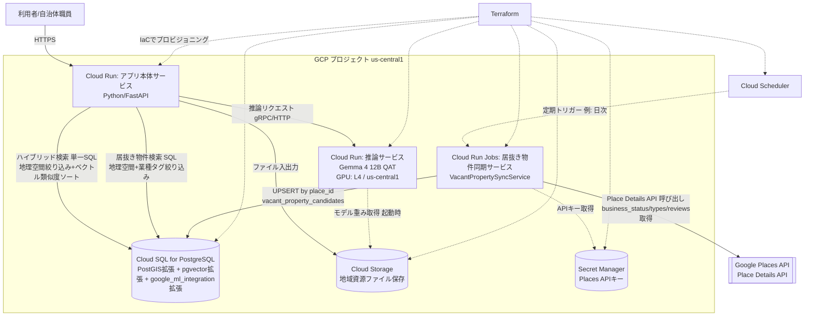
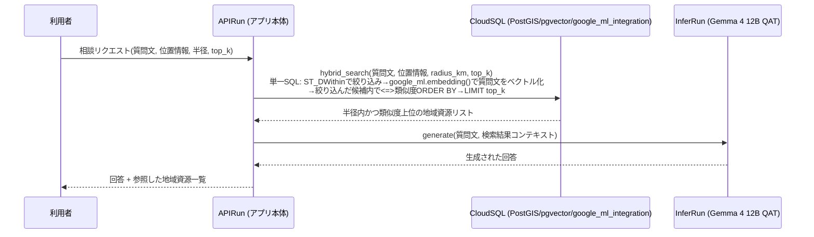
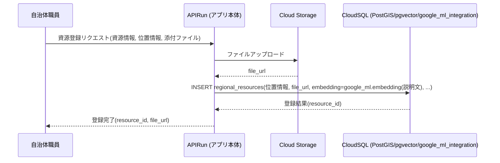
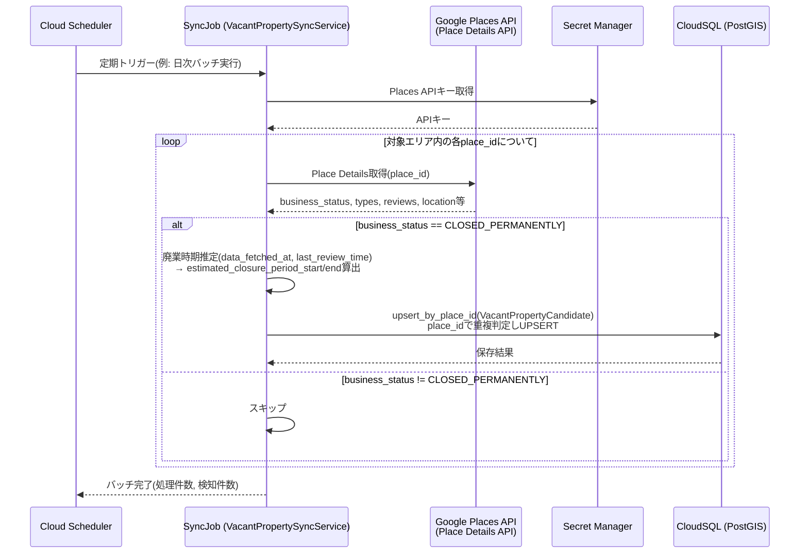
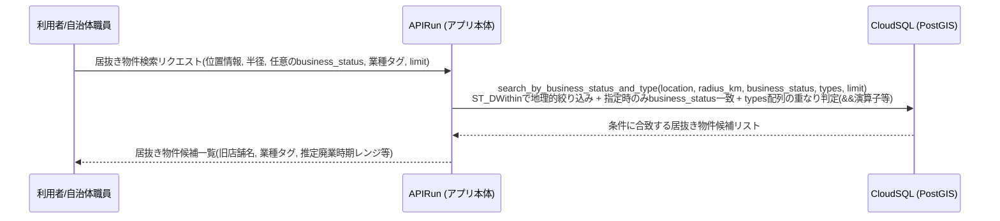

# アーキテクチャ

## システム概要

本システムは、位置情報データベース（地理空間インデックス）とベクトルデータベース（pgvector）を組み合わせたRAG（Retrieval-Augmented Generation）基盤により、地方創生に関する相談・地域資源検索・情報提供を支援します。さらに、Google Maps Platform Places APIを用いて閉店・廃業したスポットを検知し「居抜き物件」として蓄積・検索できる機能を提供します。

すべてGoogle Cloud Platform（リージョン: `us-central1`）上に構築され、インフラはTerraformでコード化されています。

## 全体構成図



## コンポーネント一覧

| コンポーネント（呼称） | 役割 | 実行基盤 | 実装ファイル |
|---|---|---|---|
| APIRun | アプリ本体サービス。相談応答・地域資源登録・居抜き物件検索のHTTP APIを提供 | Cloud Run（GPUなし） | `src/regional_revitalization/api.py` |
| InferRun | 推論サービス。Gemma 4 12B QATモデルによるテキスト生成 | Cloud Run（GPU: NVIDIA L4） | `src/regional_revitalization/infer_run_api.py` |
| Artifact Registry | APIRun/InferRun/居抜き物件同期サービスのコンテナイメージ格納リポジトリ | Artifact Registry（Docker形式） | `terraform/modules/artifact_registry/` |
| VacantPropertySyncService | 居抜き物件同期サービス。Places APIを呼び出し閉店検知・DB保存を行う定期バッチ | Cloud Run Jobs（Cloud Schedulerで定期トリガー） | `src/regional_revitalization/vacant_property_sync_job.py` |
| Cloud SQL for PostgreSQL | 地域資源・居抜き物件候補・相談履歴を保存するデータストア | Cloud SQL（プライベートIP） | `migrations/001_init_schema.sql` |
| Cloud Storage | 地域資源に紐づくファイル（画像・PDF等）の保存先 | Cloud Storage（非公開バケット） | `src/regional_revitalization/storage.py` |
| Secret Manager | DB接続情報、Places APIキー等の機密情報管理 | Secret Manager | `terraform/modules/cloudsql/`, `terraform/modules/cloudrun_jobs_vacant_property_sync/` |

## 設計判断とその理由

- **アプリ本体サービスと推論サービスをCloud Runで分離する**: GPU(L4)を必要とするのは推論処理のみ。分離することでアプリ本体サービスはGPUなしの安価な構成でスケールでき、コストを最適化できる。
- **Cloud SQL for PostgreSQLに地理空間インデックスとpgvectorを同一DBに統合する**: 地域資源テーブルに対して「近隣検索（地理空間）」と「類似検索（ベクトル）」を同一トランザクション・同一クエリ経路で扱えるため、ハイブリッド検索を単一SQLクエリで実現できる。
- **embedding生成を`google_ml_integration`拡張によりSQL側（DB側）で行う**: アプリケーション側で外部のembeddingモデルを呼び出す往復（レイテンシ・ネットワークコスト）を避け、INSERT文・検索クエリ内でembedding生成とベクトル格納/比較を一貫して行える。
- **Cloud Storageをファイル本体の保存先とし、Cloud SQLにはメタデータとURLのみを保存する**: 大容量バイナリをRDBMSに直接格納しないことで、DBサイズとバックアップコストを抑える。
- **居抜き物件同期サービスをアプリ本体サービスと分離しCloud Run Jobs（Cloud Scheduler経由の定期バッチ）として構成する**: Places APIの呼び出しはユーザーリクエストとは無関係な定期バッチ処理であり、常時起動のCloud Runサービスとして持つ必要がない。バッチ実行のみリソースを確保するCloud Run Jobsとすることでコストを最適化する。
- **居抜き物件候補データを既存のCloud SQL（同一インスタンス）に統合する**: 既存の`regional_resources`テーブルと同じPostGIS地理空間インデックスの仕組み（`GEOGRAPHY(POINT, 4326)`、`ST_DWithin`）を再利用でき、地域資源検索と居抜き物件検索を同一のデータ基盤・同一の運用オペレーションで扱える。

## 主要フロー

### フロー1: 相談応答（ハイブリッド検索 + RAG生成）



ハイブリッド検索は、RRF（Reciprocal Rank Fusion）による並列統合ではなく、**段階的フィルタリング方式**を採用しています。

1. **Step 1（PostGISによる絞り込み）**: `ST_DWithin`により、指定した位置から半径`radius_km`以内の地域資源に候補集合を絞り込む。
2. **Step 2（候補集合内でのベクトル類似度ソート）**: 絞り込んだ候補集合の中で、`query_text`から`google_ml_integration`拡張により生成したembeddingとのpgvectorコサイン距離（`<=>`演算子）でソートし、上位`top_k`件を取得する。

これは単一のSQLクエリで実現され、アプリ側でのループ処理・スコア統合処理は発生しません。候補集合が0件の場合はベクトル類似度計算自体を行わず、空リストを返します。

### フロー2: 地域資源の登録



ファイルのアップロードが失敗した場合、データベースへの登録は実行されません（部分登録の防止）。

### フロー3: 居抜き物件の同期・検知



詳細は [vacant-property-feature.md](./vacant-property-feature.md) を参照してください。

### フロー4: 居抜き物件の検索



## ソースコード構成

```
src/regional_revitalization/
├── models.py                              # GeoPoint, RegionalResource, ConsultationRequest/Response
├── repository.py                           # ResourceRepository Protocol, InMemoryResourceRepository, hybrid_search()
├── postgres_repository.py                  # ResourceRepositoryのCloud SQL実装（asyncpg）
├── registration.py                         # register_resource()（地域資源登録）
├── storage.py                              # StorageClient Protocol, GcsStorageClient（Cloud Storage）
├── inference.py                            # InferenceClient Protocol, GenerateRequest/Response, HttpInferenceClient
├── consultation.py                         # generate_consultation_response()（相談応答）
├── api.py                                  # アプリ本体サービス（APIRun）のFastAPIエンドポイント、起動時ブートストラップ
├── infer_run_api.py                        # 推論サービス（InferRun）のFastAPIエンドポイント
├── vacant_property.py                      # 居抜き物件関連のデータモデル・ロジック（VacantPropertyCandidate等）
├── postgres_vacant_property_repository.py  # VacantPropertyRepositoryのCloud SQL実装
└── vacant_property_sync_job.py             # 居抜き物件同期サービス（Cloud Run Jobs）のエントリポイント

terraform/                                  # Terraformコード（インフラのコード化）詳細はdeployment-guide.md参照
├── modules/artifact_registry/              # コンテナイメージ格納用リポジトリ
└── modules/github_actions_wif/             # GitHub ActionsからのWorkload Identity連携

docker/                                     # 各サービスのコンテナイメージ定義（マルチステージビルド、非rootユーザー実行）
├── api/Dockerfile                          # APIRun用
├── infer/Dockerfile                        # InferRun用
└── vacant_sync/Dockerfile                  # 居抜き物件同期サービス用

.github/workflows/                          # GitHub ActionsによるCI/CDパイプライン
├── ci.yml                                  # テスト・terraform validate・dockerビルド確認（再利用可能ワークフロー）
└── deploy.yml                              # mainブランチpush時のビルド・プッシュ・terraform apply
```

**起動時ブートストラップ（`api.py`）**: APIRunはFastAPIの`lifespan`パラメータ（`_lifespan`）でアプリ起動時に`_bootstrap_production_dependencies()`を呼び出す。環境変数`DATABASE_URL`/`GCS_BUCKET_NAME`/`INFERENCE_SERVICE_URL`が設定されている場合のみ、インメモリ/モック実装から実運用実装（`PostgresResourceRepository`/`GcsStorageClient`/`HttpInferenceClient`）へ自動的に差し替える。環境変数が未設定のローカル開発・単体テストではインメモリ実装のままとなる。

**推論サービスへのHTTP呼び出し（`inference.py`のHttpInferenceClient）**: APIRunからInferRunへの呼び出しをHTTP経由で行う実装。Cloud Run環境ではメタデータサーバーから取得したIDトークンを`Authorization: Bearer <token>`ヘッダーに設定し、Cloud RunのIAM認証と組み合わせて使用する。ローカル実行等でIDトークンが取得できない場合は認証ヘッダーを付与しない。

## セキュリティ設計

- **サービス間通信**: APIRunからInferRunへの呼び出しはCloud RunのIAM認証（サービスアカウント経由の識別トークン）を用いる。InferRunは`allUsers`に公開しない。
- **Cloud SQL接続**: プライベートIPまたはCloud SQL Auth Proxy経由で接続し、パブリックIPを無効化する。
- **認証情報管理**: DB接続情報・Places APIキー等のシークレットはSecret Managerで管理し、Terraformの状態ファイルに平文で残さない。
- **Cloud Storageアクセス制御**: アップロードされたファイルは非公開バケットに格納し、利用者への提供は署名付きURL（有効期限付き）で行う。本バケットはTerraformのtfstate保存先と共用し、`resources/`（地域資源ファイル）・`terraform/state/`（tfstate）のプレフィックスで用途を分離する。APIRun実行用サービスアカウントにはIAM条件により`resources/`配下のみへのアクセス権限を付与し、tfstateへはアクセスできない（詳細は`docs/deployment-guide.md`参照）。
- **入力検証**: 位置情報・クエリ文字列等はアプリ本体サービスの境界で必ず検証し、SQLインジェクション対策としてパラメータ化クエリを使用する。
- **Places APIキーの管理**: 居抜き物件同期サービスの実行用サービスアカウントにのみアクセス権限（`roles/secretmanager.secretAccessor`）を付与し、他コンポーネントからは参照不可とする。

詳細な認証・認可・シークレット管理の実装内容は各コンポーネントのソースコード内docstringも参照してください。
